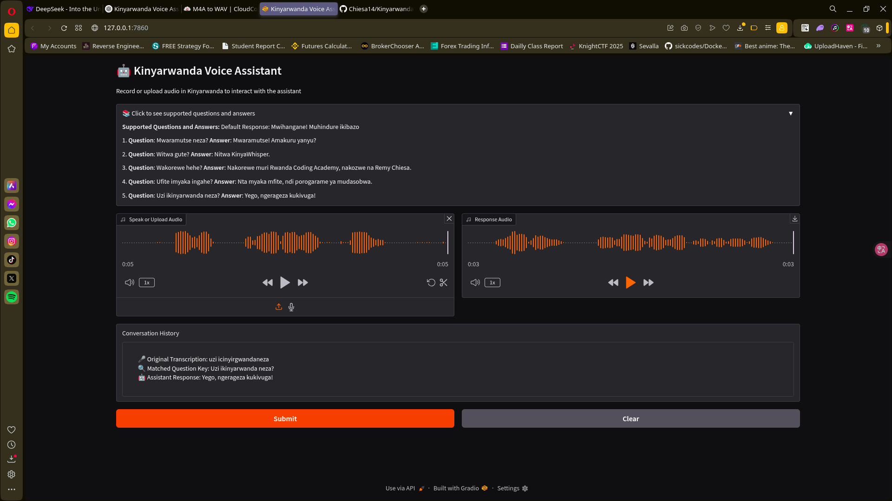

# Kinyarwanda Voice Assistant 🤖

[](https://opensource.org/licenses/MIT)
[](https://www.python.org/)

An intelligent voice assistant for Kinyarwanda language interaction, developed as part of the Intelligent Robotics course.

  

## Features 🌟
- 🎙️ **Kinyarwanda ASR** using KinyaWhisper (16kHz optimized)
- 🧠 **Contextual Understanding** with fuzzy logic matching
- 📢 **Natural Responses** with Kinyarwanda TTS
- 🔇 **Noise Reduction** using advanced audio cleaning
- 🎚️ **Voice Activity Detection** for precise speech recognition
- 🔄 **Anti-Repetition** transcription filters
- 📊 **Conversation Analytics** with matching insights
- 🌐 **Web Interface** with Gradio integration

## Tech Stack 🛠️
- **Core AI**: Hugging Face Transformers
- **Audio Processing**: Librosa + Soundfile
- **NLP**: FuzzyWuzzy + Python-Levenshtein
- **Interface**: Gradio
- **Optimization**: WebRTC VAD + Noisereduce

## Installation 💻

### Prerequisites
- Python 3.8+
- FFmpeg (audio processing):
  ```bash
  # Ubuntu/Debian
  sudo apt-get install ffmpeg
  
  # macOS
  brew install ffmpeg
  
  # Windows (via chocolatey)
  choco install ffmpeg
  ```
  
## Quick Start 🚀

- Clone repository
  ```bash
    git clone https://github.com/Chiesa14/KinyarwandaVoiceAssistant.git
  
    cd kinyarwanda-voice-assistant
  ```
- Set up virtual environment
  ```bash
  python -m venv .venv
  source .venv/bin/activate  # Linux/macOS
  .\.venv\Scripts\activate   # Windows

  ```
- Install dependencies
  ```bash
  pip install -r requirements.txt
  ```

## Configuration ⚙️

#### QA Configuration in `nlp_mapping.json`

  ```json
  {
    "qa_pairs": [
      {
        "question": "Mwaramuce neza?",
        "answer": "Mwaramutse! Amakuru yanyu?"
      }
    ],
    "default_response": "Vugurura ikibazo."
  }
  ```

#### Audio Files
You can find sample Kinyarwanda recordings in the `/sample_inputs` folder

Supported formats: `WAV`, `MP3`, `OGG`